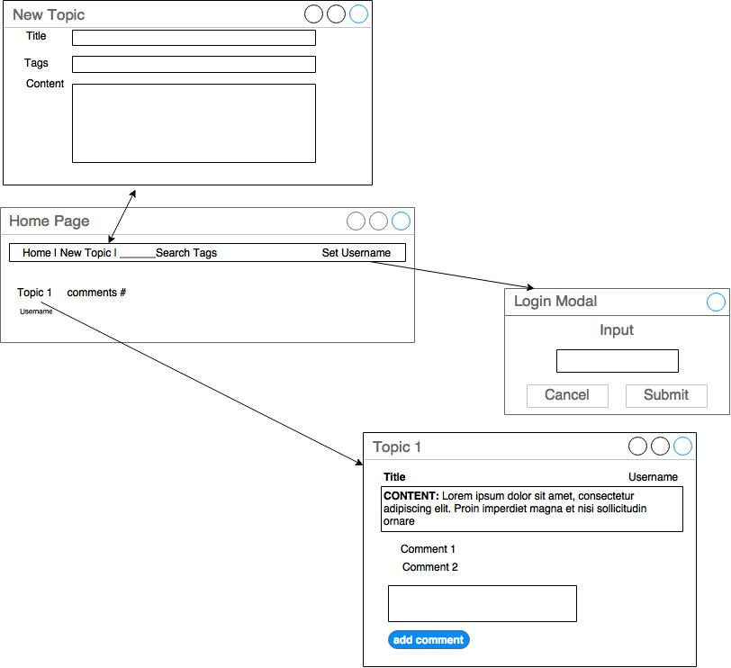
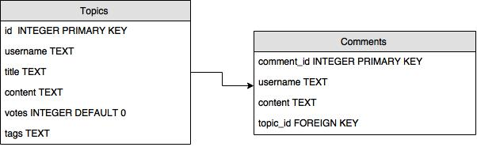

# forum

This project is a forum where a user can create different discussion topics and comment on existing forum topics.  The usernames are not password protected and anything that is UTF-8 can be chosen.
___________________
### User Stories:

A user will see a list of topics already created by other users in the home page. If they wish to create a topics of they can choose a username by clicking "Set Username" in the upper right corner. The username is not password protected. Anyone can use any username.

Users can see the number of comments on each topic and can vote on which topics they like the most and comment on any existing topic. 

__________________
###Wire Frame:

____________________
###ERB:

